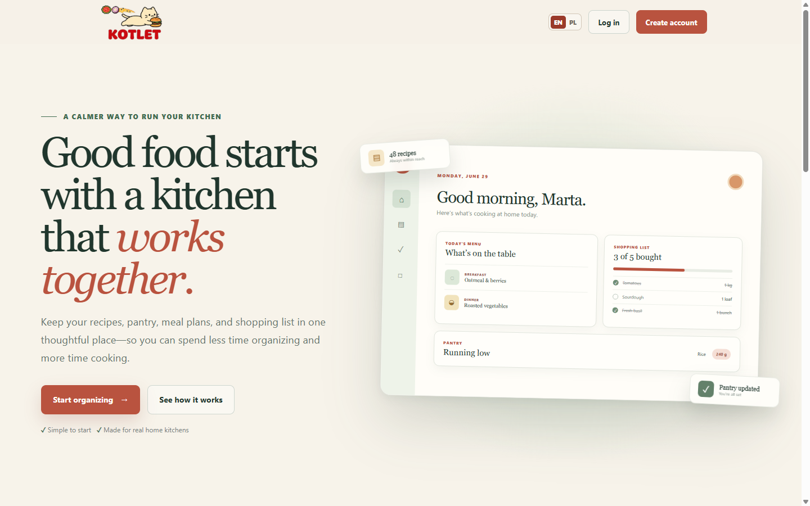
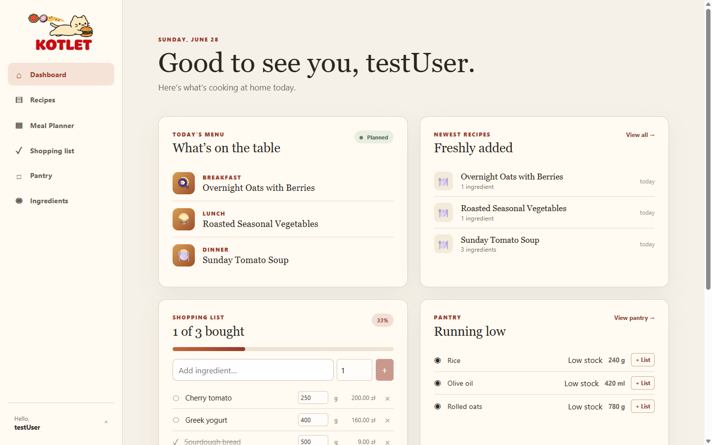
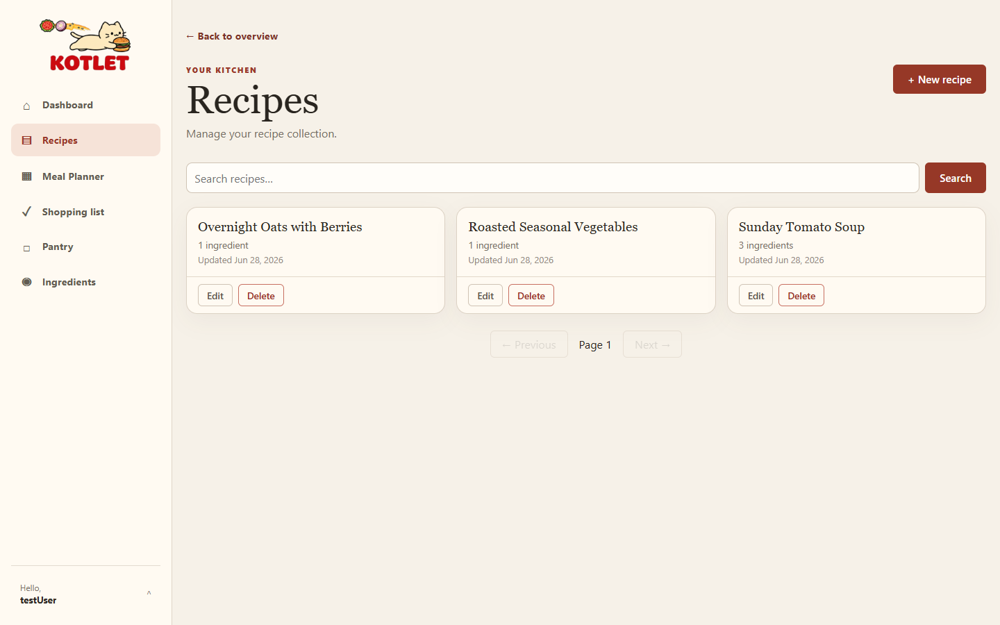
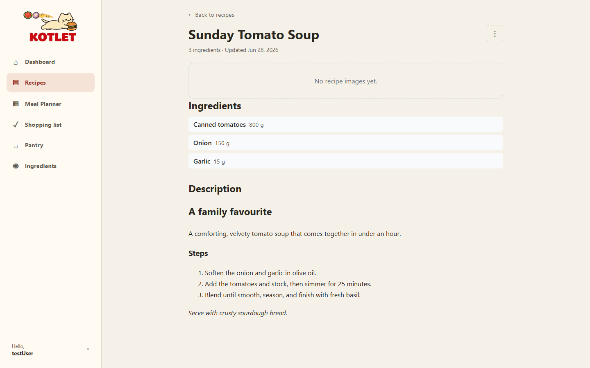
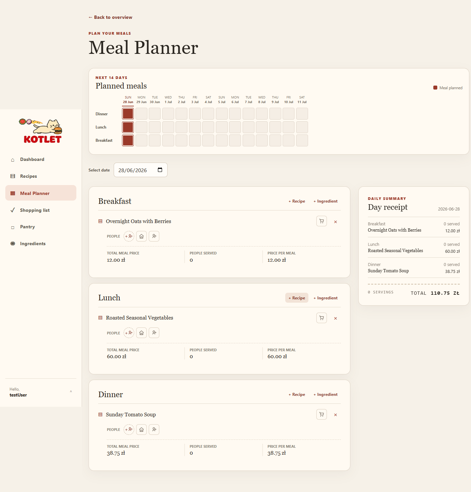
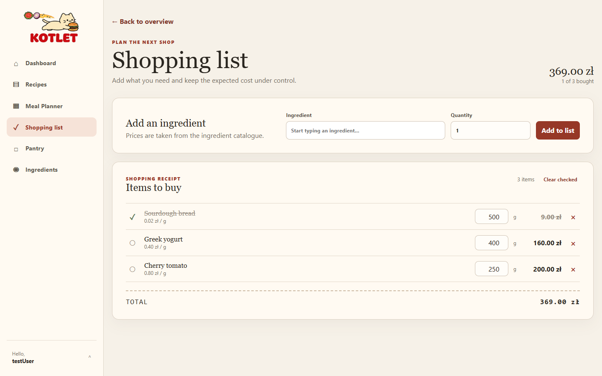
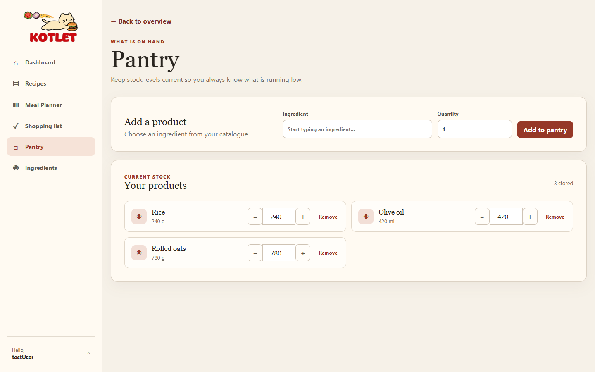
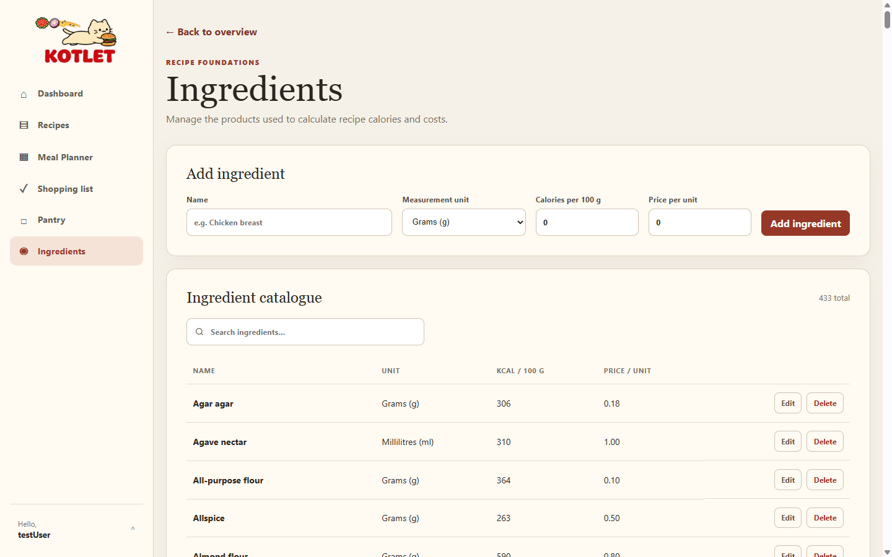

# Kotlet

**A calmer way to run your kitchen.**

Kotlet keeps your recipes, pantry, meal plans, and shopping list in one thoughtful
place — so you can spend less time organizing and more time cooking. It's built for
real home kitchens, where the small daily question *"what should we eat?"* turns into
dinner on the table.



---

## What you can do with Kotlet

Everything in Kotlet is connected. Plan a meal and its ingredients flow into your
shopping list; track your pantry and see what's running low before it becomes a
last-minute surprise.

### A dashboard for your day

Open Kotlet and see what's cooking today — the planned menu, your shopping progress,
the newest recipes, and what's running low in the pantry, all at a glance.



### Your recipes, beautifully kept

Save family favorites and new discoveries with ingredients, step-by-step instructions
(written in Markdown), and photos — all in one easy-to-find collection.




### Plan meals for the week ahead

Lay out breakfast, lunch, and dinner across the next two weeks. Add recipes or single
ingredients to any day, set how many people you're serving, and Kotlet works out the
cost per meal and a daily "receipt" so there are no surprises.



### A shopping list that makes sense

Keep one clear list with quantities and prices pulled straight from your ingredient
catalogue. Check items off as you shop and watch the expected total stay under control.



### Know what you already have

Keep your pantry stock current so you always know what's on hand and what needs
restocking — one tap moves a low item onto your shopping list.



### A shared ingredient catalogue

Recipes, planning, and shopping all draw on a single catalogue of ingredients with
their units, calories, and prices — so calorie and cost estimates stay consistent
everywhere.



Kotlet also supports **multiple accounts in one household**, **English and Polish**,
and an **admin area** for managing users.

---

## Try it locally

You'll need: the **.NET 10 SDK**, **Node.js 22.22+ or 24.x** with npm, and a
Docker-compatible container runtime.

```powershell
dotnet run --project src/aspire/Kotlet.AppHost
```

This starts everything together — the API, the Angular app, and a local PostgreSQL
database — and shows their addresses in the .NET Aspire dashboard. Open the Angular
app's URL to use Kotlet.

In development, two sample accounts are created automatically so you can sign in right
away:

| Email | Password | Role |
| --- | --- | --- |
| `testuser@kotlet.local` | `TestUser123!` | Regular user |
| `admin@kotlet.local` | `Admin123!` | Administrator |

> Sample accounts are only created in the Development environment.

### Run without Docker

For a quick spin without a container runtime, the API can use a temporary in-memory
SQLite database:

```powershell
dotnet run --project src/backend/Kotlet.Api --launch-profile sqlite
```

Then start the frontend in a second terminal:

```powershell
npm --prefix src/frontend start
```

---

## How Kotlet is built

- **Frontend:** Angular 21 (single-page app)
- **Backend:** ASP.NET Core on .NET 10, following Clean Architecture
- **Database:** PostgreSQL (hosted on Supabase)
- **Local orchestration:** .NET Aspire

The backend is organized by feature (Recipes, Meal Planner, Ingredients, Pantry,
Shopping, Auth, …) with dependencies pointing inward to the domain. The API is the
only component that talks to the database; the browser never connects to it directly.
For more detail see [docs/frontend-architecture.md](docs/frontend-architecture.md) and
[docs/supabase-connection.md](docs/supabase-connection.md).

---

## Deployment

Kotlet is deployed as two pieces — an API and a static frontend — backed by a managed
PostgreSQL database. Pushing to the `main` branch deploys both automatically through
GitHub Actions.

### Where each piece runs

| Piece | Hosted on | Workflow | Trigger |
| --- | --- | --- | --- |
| Backend API | Azure Web App | [`main_kotlet.yml`](.github/workflows/main_kotlet.yml) | push to `main` |
| Frontend | GitHub Pages | [`github-pages.yml`](.github/workflows/github-pages.yml) | push to `main` (frontend changes) |
| Database | Supabase (PostgreSQL) | applied manually (see below) | — |

Every pull request and every push to `develop` also runs the
[CI workflow](.github/workflows/ci.yml), which builds and tests both the frontend and
the backend.

### 1. Backend → Azure Web App

On a push to `main`, the workflow builds the frontend, publishes the .NET API, signs
in to Azure with a federated identity, and deploys to the **Kotlet** Web App.

Configure these as secure settings on the Web App (never commit them):

```powershell
# PostgreSQL connection string (Supabase)
$env:ConnectionStrings__kotletdb = 'Host=<host>;Port=5432;Database=postgres;Username=<user>;Password=<password>;SSL Mode=Require;Trust Server Certificate=true'

# JWT signing key — a unique random secret of at least 32 bytes
$env:Jwt__SigningKey = '<a-random-secret-of-at-least-32-bytes>'
```

Access tokens are short-lived JWTs; refresh tokens are delivered only through the
HTTP-only `kotlet_refresh` cookie and stored as SHA-256 hashes.

### 2. Frontend → GitHub Pages

On a push to `main` that touches the frontend, the workflow builds the Angular app
with the correct base href, adds an SPA fallback, and publishes it to GitHub Pages.
The production build points at the deployed Azure API
(`src/frontend/src/environments/environment.ts`).

### 3. Database → Supabase

The database lives in a Supabase PostgreSQL project, isolated in the `kotlet` schema
(application tables and their EF Core migration history). Apply migrations from a
trusted machine with network access to Supabase:

```powershell
# Review the SQL first when targeting a shared project
dotnet ef migrations script --idempotent `
  --project src/backend/Kotlet.Infrastructure `
  --startup-project src/backend/Kotlet.Api `
  --output kotlet-migrations.sql

# Apply
dotnet ef database update `
  --project src/backend/Kotlet.Infrastructure `
  --startup-project src/backend/Kotlet.Api
```

Migrations must only create or modify objects inside the `kotlet` schema (including
`kotlet.__EFMigrationsHistory`); existing schemas and Supabase-managed objects must
stay untouched. If the `kotlet` schema is ever exposed through the Supabase Data API,
review and enable appropriate Row Level Security policies first. See
[docs/supabase-connection.md](docs/supabase-connection.md) for the exact connection
settings.

---

## Build

```powershell
dotnet build Kotlet.slnx
npm --prefix src/frontend run build
```
